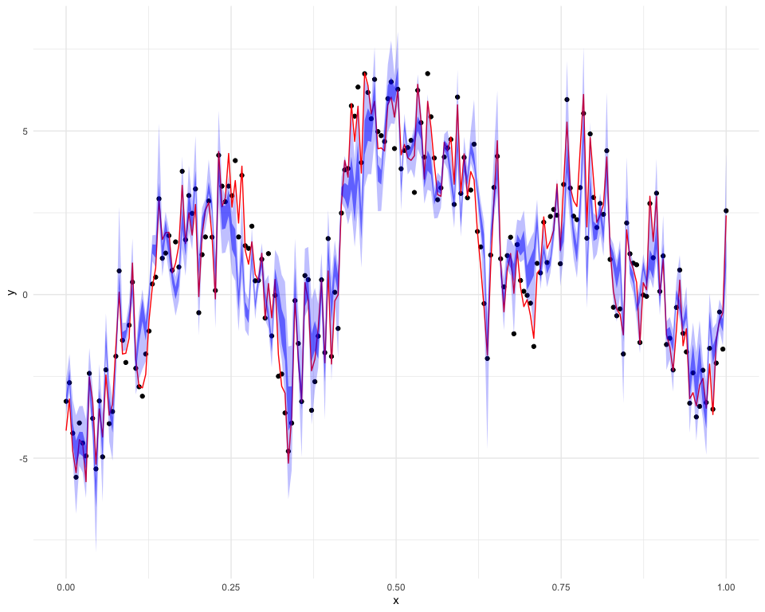

# Gaussian Process Spatial Models

Full Bayesian inference for Gaussian process regression on spatial data using Markov Chain Monte Carlo (MCMC) in R.

## Model

Implements the hierarchical spatial model:

```
y = X*beta + eta + epsilon

eta   ~ GP(0, tau^2 * C(phi))
epsilon ~ N(0, sigma^2 * I)
```

Where:
- **beta** -- regression coefficients
- **sigma^2** -- nugget (measurement error) variance
- **tau^2** -- spatial process variance
- **phi** -- spatial range parameter
- **C(phi)** -- correlation function (exponential or Gaussian kernel)

## Features

- Adaptive Metropolis-Hastings with automatic tuning (targets 44% acceptance)
- Conjugate Gibbs sampling for regression coefficients
- Posterior sampling of spatial random effects eta
- Supports exponential and Gaussian correlation kernels

## Dependencies

```r
install.packages(c("mvnfast", "truncnorm", "fields", "ggplot2"))
```

## Usage

```r
source("functions.R")

# Simulate spatial data
N <- 200
s <- seq(0, 1, length.out = N)
D <- fields::rdist(s)
X <- matrix(rnorm(N * 2), nrow = N, ncol = 2)

# Run MCMC
tuning <- list(phi_tune = 0.2, sigma2_tune = 0.03, tau2_tune = 2)
fit <- mcmc_gp(y, X, D,
               form = "exponential",
               tuning_parameters = tuning,
               n_mcmc = 5000, burnin = 2500)

# Sample spatial random effects
fit <- sample_eta(y, fit, D)
```

See [`main.R`](main.R) for a complete simulation example with trace plots and credible intervals.

## Example Output

Fitted spatial process with 50% and 95% posterior credible intervals:



## References

- Banerjee, S., Carlin, B. P., & Gelfand, A. E. (2014). *Hierarchical Modeling and Analysis for Spatial Data* (2nd ed.). Chapman & Hall/CRC.
- Diggle, P. J., & Ribeiro, P. J. (2007). *Model-based Geostatistics*. Springer.
